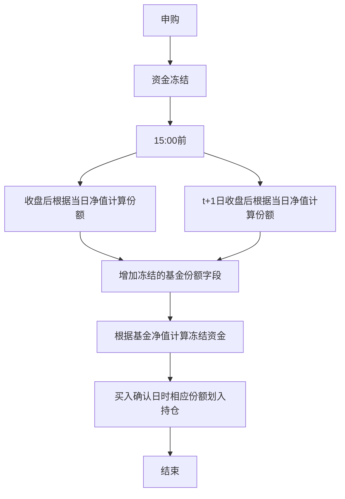
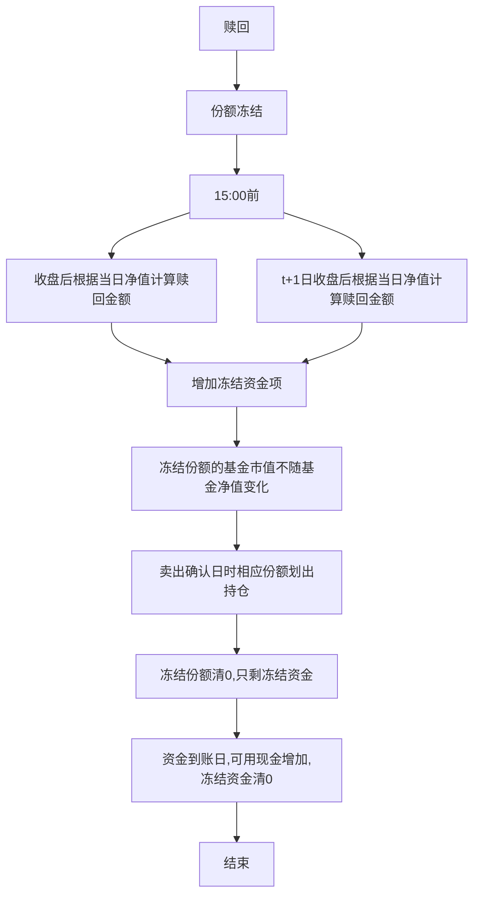

# 场外基金回测引擎
## 费率

**申购（认购）费用——前后端收费**
申购（认购）就是在基金成立后的存续期间（认购则是在基金发行时的募集期间），投资者向基金公司购买基金份额的交易行为。在交易过程中，投资者都需要向基金公司支付一定的手续费。这种手续费，称为申购（认购）费用。
申购（认购）费用分为**前端收费**和**后端收费**两种模式。前端收费指的是你在购买开放式基金时就支付申购费的付费方式。后端收费指的则是你在购买开放式基金时并不支付申购费，等到卖出时才支付的付费方式。后端收费的设计目的是为了鼓励你能够长期持有基金，因此，后端收费的费率一般会随着你持有基金时间的增长而递减。某些基金甚至规定如果你能在持有基金超过一定期限后才卖出，后端收费可以完全免除。

- 前端申购费用计算公式：

$$
申购费用=净申购金额 \times 申购费率\times折扣率\\净申购金额=申购金额-申购费用\\根据公式1和2得到：净申购金额=申购金额\div \left ( 1+申购费率\times折扣率 \right)\\申购费用=申购金额\times申购费率\times折扣率\div\left( 1+申购费率\times折扣率 \right )
$$

- 后端申购费用计算公式：

$$
后端申购\div 认购费用=赎回份额\times基金净值\times对应份额后端申购(认购)费率
$$

## 平台折扣

通过不同平台购买基金，折扣率会不同，回测中默认值为0.1，也可以通过函数set\_discount\_rate()函数来自定义设置申购折扣率。

- 各平台费率参考：


| 平台名称   | 折扣率   |
| ---------- | -------- |
| 爱基金     | 0.1      |
| 天天基金网 | 0.1      |
| 好买基金网 | 0.1\~1.0 |

- **注意**：当前所有平台只对前端申购费用进行打折，其他费用不应用折扣率这一参数。

## 赎回费用

赎回就是投资者将持有的基金份额卖给基金公司的交易行为。在交易过程中，投资者需要向基金公司支付一定的手续费，这种手续费，称为赎回费用。

- **赎回费用公式**：赎回费用=赎回份额X基金净值X赎回费率

由于赎回费用会根据持有期的长短进行调整，所以赎回的不同持有期的基金份额使用不同赎回费率，从申购/认购确认日开始计算到当前日（获取净值的日期）的自然日天数。遵循先进先出原则。

例如：3月1日申购了100份，4月1日申购了500份，5月1日赎回200份，则其中100份的持有期从3月1日算为61天，另外100份从4月1日起算为30天。同样，后端申购费率也采用这种机制。

## 管理费用、托管费用、销售服务费用

基金管理费是基金公司，也就是基金管理人的管理报酬，是基金公司的主要收入方式。 基金管理费是按日计提，月底由基金托管人（在我国是托管银行）从基金总资产中一次性支付给基金管理人，不另外向投资人收取。

- **每日应付的基金管理费**＝前一日的基金资产净值X年管理费率/当年天数

比如基金管理费，年费率为1.5%，这一年有365天，某只基金前一日基金资产净值为100亿元，则该日基金管理费计提额=10000000000X1.5%/365=41万。
也就是一只管理资产总额在100亿的基金，年管理费率为1.5%的情况下，一天的管理费在41万。每天计提管理费，月底支付一次。同样，基金托管费，销售服务费也是这样收取的。直接从基金总资产中扣除，每日公布的基金净值是已经扣除了管理费、托管费和销售服务费的。因此，在回测中不在额外对这三项费用进行扣除。

## 认购期

基金首次发售基金份额称为基金募集，在基金募集期内购买基金份额的行为称为基金的认购，一般认购期最长为一个月。而投资者在募集期结束后，申请购买基金份额的行为通常叫做基金的申购。在基金募集期内认购，一般会享受一定的费率优惠。

## 封闭期

开放式基金的封闭期是指基金成功募集足够资金宣告基金合同生效后，会有一段不接受投资人申购及赎回基金份额申请的时间段。设定封闭期一方面是为了方便基金的后台(登记注册中心)为日后申购、赎回做好最充分的准备；另一方面基金管理人可将募集来的资金根据证券市场状况完成初步的投资安排。根据《证券投资基金运作管理办法》规定，基金封闭期不得超过3个月。

## 申购期

基金募集期结束并成立后，再经过一段时间的封闭期，投资者就可以根据基金销售网点规定的手续购买/赎回基金份额，这一交易状态开放时间称为申购期。此时由于基金净值已经反映了其投资组合的价值，因此每单位基金份额净值不一定为1元，可能高于也可能低于1元，故同一笔资产认购和申购同一基金所得到的基金份额数将有可能不同。同时，多数基金销售网点对基金申购费用都有一定的折扣（前端申购费）。

## 申购份额/赎回金额计算

- **申购份额计算**：

$$
净申购金额=申购金额\div\left(1+申购费率\times折扣率\right)\\申购份额=净申购金额\div基金净值
$$

- **赎回金额计算**：

赎回金额=赎回份额X基金净值-后端申购/认购费用-赎回费用
后端申购/认购费用=赎回份额X基金净值X对应份额后端申购（认购）费率
赎回费用=赎回份额X基金净值X赎回费率
其中基金净值对应的值按一下规则获取：
15：00前申购/赎回的，获取当日净值
15：00后申购/赎回的，获取下一交易日净值

## 申购份额/赎回金额确认机制

基金的购买时间是指基金申购交易当天；基金的确认时间：是指基金申购之后基金公司系统受理，一般是T+1天确认，不过具体时间还要根据基金公司公布的确认制度来确定。
基金规定交易日当天15点前交易，属于当天申购，按当天的基金净值确认份额，超过15点算下一个交易日。
比如你星期五晚上申购一只基金，晚上可以理解为15点以后了，当天收盘价是1元，过了周末，到周一是1.1元，周二是1.2元。那么你的申购的价格是1.1元。但是确认申购成功日是基金规定的T+X的那个X日，比如周五晚上买，按照下周一的净值计算份额，确认日期比如是T+1日，那确认申购成功日期就是下周二，从申购日到确认日资金会被冻结。基金赎回确认机制也和申购机制相同，15点前提交赎回的按当日净值进行计算金额，确认日采用T+N制度，从赎回至确认日赎回的基金份额会冻结。

## 在途份额/资金

申购或赎回基金后，需要N个交易日进行确认，N根据每个基金规定的确认日T+N制度进行确定。用户申购基金后，相应的资金需要进入冻结状态。未到买入确认日，持仓中不显示相应的基金份额，相应的资金金额冻结，可用现金减少。到确认日后，申购的基金份额进入持仓记录中，冻结的资金金额清0。同理，在用户赎回基金份额时，赎回发起时开始冻结相应的份额（可用份额减少），冻结的份额市值将不再随基金的净值进行变动（15:00后赎回的市值按T+1日净值进行确认），同时可用现金部分不增加。回测中可通过Get\_frozen\_asset()函数进行查询当前冻结的资产（基金份额或资产）。

- 申购流程



- 赎回流程



## 基金分红

- **除息日**

除息日又称为“除权日”。在除息日当天，将进行分配的资产收益部分（即分红的资金）从基金资产中扣除，因此当天的净值一般会降低（假设分红当天股市没有涨跌的情况下）。

- **权益登记日**

权益登记日是指登记享有分红权益的基金份额的日期，基金份额持有人在权益登记日持有的基金份额享有利润分配的权利。

- **红利发放日**

基金会在这天从基金托管帐户划出分红资金，将红利派发给在权益登记日前买入基金的投资者。投资者会在当日收到现金分红，相应的投资账户中的可用现金会增多。

- **分红模式**

基金公司进行分红时，通常提供两种分红模式：现金分红及红利再投资。可通过set\_dividend\_mode()函数进行设置。
现金分红方式就是基金公司将基金收益的一部分，以现金派发给基金投资者的一种分红方式。相应的现金部分会在红利发放日到账。
红利再投资方式就是基金投资者将分红所得现金红利再投资该基金，以获得基金份额的一种方式。再投资的基金份额根据除息日的基金净值进行计算：再投资份额=分红总额/除息日基金净值。

## 基金清算

基金清算是指基金遇有合同规定或法定事由终止时对基金财产进行清理处理的善后行为。基金合同终止时，应当按法律法规和本基金契约的有关规定对基金进行清算，基金管理人应当组织清算组对基金财产进行清算。清算组由基金管理人、基金托管人以及相关的中介服务机构组成。清算组作出的清算报告经会计师事务所审计，律师事务所出具法律意见书后，报国务院证券监督管理机构备案并公告。清算后的剩余基金财产，应当按照基金份额持有人所持份额比例进行分配。
回测时按基金到期日的净值作为最后的净资产（和实际情况存在偏差）。

## 【场外基金案例】

```python
def init(context):
    # 设置3个子账户，股票，期货，场外基金初始资金都为100000
    set_subportfolios([{'cash': 100000, 'type': 'fund'}, {'cash': 100000, 'type': 'future'}, {'cash': 100000, 'type': 'stock'}])

    # 设置申购折扣率
    set_discount_rate(0.2)

    # 设置分红模式
    set_dividend_mode('cash')

    # 000717发行日为20141218，封闭期20150114-20150226,申购起始日期20150227，买入赎回确认日为T+1，资金到账确认日T+7
    context.ins = '000717.OF'
    context.day = 1

def handle_bar(context, bar_dict):
    if context.day == 1:
        # 获取当前可交易的所有基金列表
        fund_list = get_available_fund()
        log.info(fund_list, len(fund_list))

        # 第一天下单10000元
        order_id = order_fund(context.ins, 50000)
        log.info('买入', order_id)
    elif context.day == 2:
        # 第二天买入确认
        pass
    elif context.day == 3:
        # 第三天赎回1000份
        order_id = redeem_fund(context.ins, 10000)
        log.info('赎回', order_id)
    elif context.day == 4:
        # 第四天赎回确认
        pass

def after_trading(context):
    context.day += 1
```

## 【月定投案例】

```
#场外基金定投策略
def init(context):
    # 设置3个子账户，股票，期货，场外基金初始资金都为100000
    set_subportfolios([{'cash': 120000, 'type': 'fund'}])
    # 设置申购折扣率
    set_discount_rate(0.2)
    # 设置分红模式
    set_dividend_mode('invest')
    #确定定投标的景顺长城沪深300增强(000311)
    context.ins = '000311.OF'
    #每月月末买入
    run_monthly(trade,date_rule=-1)
def trade(context, bar_dict):
    order_id = order_fund(context.ins, 10000)
    log.info('申购', order_id)
```
