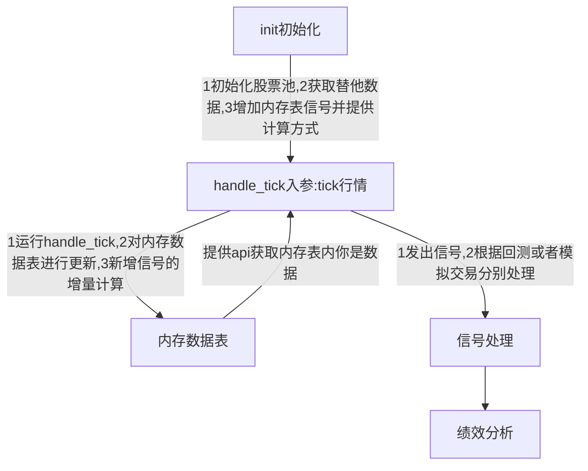

# T+0回测引擎
## T+0 交易简介

在中国证券市场中，实行的是T+1制度，即股票当天买进之后第二天才能卖出。

而日内回转交易即是：因为股票的价格每日都会产生波动，当天单只最大振幅甚至能达到20%【在涨停和跌停之间来回波动】，基于这个基础我们可以进行如下操作： 在账户里有股票也有一定可操作资金情况下，先当天以高价卖出之前买进的股票，再以当天低价买入；或当天以低价买入持有的股票，再以当天高价卖出。

假设，你手中已经持有“建设银行”1000股，成本10元/股。当天振幅较大，先翻绿下跌，在9.5元/股处你买进1000股，目前你已经有2000股“建设银行”股票【本来持有的1000股和今天刚买进的1000股】。

随后该股飘红上涨，在10.5元/股你卖出1000股【最多只能卖1000股，可以少于1000股，这个1000股是你以前持有的，而非今天买入的】，当天买进的1000股是不能卖出的【受T+1规定限制——中国证券市场当天买入的股票不能当天卖出】

此时，你完成了一个标准的T+0操作。你当天获利1000元【未扣除交易费】

**总结就是：在已经有一定底仓的情况下，通过T+0交易，使得持仓不变，现金增加。**

## T+0 交易流程



## 下单及撮合

下单函数以及订单处理函数与之前SuperMind一致，只是对于撮合规则的设计稍有不同。

- **市价单**
  市价单根据set\_volume\_limit函数的设置，按照盘口的状态进行撮合，如果未能全部成交，剩余撤单。买入指令按照卖1至卖10进行撮合，卖出指令按照买1至买10进行撮合。
- **限价单**
  限价单同样采用盘口进行撮合，买入时，使用小于等于买入价的盘口进行撮合，卖出时使用大于等于卖出价的盘口进行撮合。
  比如买入价格为10.11，盘口价格为10.09、10.10、10.11、10.12、10.13，则使用10.09/10.10/10.11的盘口挂单量进行撮合。
  当卖盘价格均大于买入价格时或者盘口挂单量不足导致无法成交时，订单持续保留，直到最终成交或被取消。
- **撮合时间规定**

（1） 设开盘价出现的第一个tick为x，通常为9:25:03，如下图所示：300033在20180522出现的第一个开盘价是48.6，时间为9:25:03。


（2） (x, 9:30)之间的下单均为废单，不进行撮合。日志提示：“下单无效”。
（3） [9:15, x]之间下的市价单，均按照x点的信息进行撮合。若下了多单，则按顺序撮合。
（4） [9:15，x]之间下的限价单，也按照x点的信息进行撮合，如果撮合不成功，则保留单子到开盘后进行撮合。

- **撮合机制**
  将目前的单一市价单扩充为5种市价单：

  - ①对手方最优价格申报
  - ②本方最优价格申报
  - ③即时成交剩余撤销申报
  - ④最优5档即时成交剩余撤销申报
  - ⑤全额成交或撤销申报
  - 其中①②市价单本质为限价单，需要连续Tick撮合，即该tick未完全成交则下一tick继续撮合，直至成交完全、收盘或撤单；而③④⑤仅为撮合当前tick一次，不再下一tick继续撮合。

## 持仓设定

---

由于T+0的特殊性，需要有底仓的存在，而且保持股数不变。

- ** 持仓的限制**
  T+0的目标是保持股数不变，现金增加。所以需要在交易中进行一些限制，以保证每天的股数不发生变化，即每日买入卖出量都不超过持仓量。
- **收盘前必须强行平仓**
  14:56，强行将未成交的委托撤单，未平仓的仓位平仓，将持仓数量恢复至昨日持仓量。（即时停牌或者涨跌停，也按照当前tick的价格进行强行平仓）。
- **收盘前不得下单**
  14:55之后，不得进行下单操作（包括开仓和平仓）。

## 滑点

---

暂无法设置滑点

## 手续费

---

默认为交易额的0.025%，最少5元
可以通过[set\_commission](http://quant.10jqka.com.cn/platform/html/help-api.html?t=-4#535/656 "set_commission")来设置具体的手续费参数。

## 绩效分析定义

---

- **“每日T+0收益”定义：**

$$
因为T+0策略有默认持仓，因此今日T+0收益 = 今日总收益 - 今日持仓收益。
$$

$$
具体计算方法①：今日T+0收益 = （今日总资产 - 昨日总资产） - （今日持仓总市值 - 昨日持仓总市值）\\
具体计算方法②：今日T+0收益 = 今日每笔T+0交易的盈亏之和，若无T+0交易则今日T+0收益为0
$$

- **“一笔T+0交易”的定义为：**
  - 当某只股票的持仓量从小于等于初始持仓量变为大于初始持仓量，表示做多开始；当某只股票的持仓量从大于初始持仓量变为小于等于初始持仓量，表示做多结束；当做多开始与做多结束在同一天内即为一笔完整的T+0做多交易。
  - 当某只股票的持仓量从大于等于初始持仓量变为小于初始持仓量，表示做空开始；当某只股票的持仓量从小于初始持仓量变为大于等于初始持仓量，表示做空结束；当做空开始与做空结束在同一天内即为一笔完整的T+0做空交易。

**示例：**
例1：000001.SZ初始持仓1000股，在同一天内，先买入100股，再买入200股，最后卖出300股，则为一笔300股的做多交易；
例2：在同一天内，先买入100股，再买入200股，再卖出500股，最后买入200股，则为一笔300股的做多交易和一笔200股的做空交易；
例3：在同一天内，先买入100股，再买入200股，再卖出500股，再买入100股，最后买入100股，则为一笔300股的做多交易和一笔200股的做空交易；

**综上，今日T+0收益 = 今日T+0做多交易的盈亏之和 + 今日T+0做空交易的盈亏之和。**

## 绩效分析示例

---

- **绩效分析示例：**
  单笔T+0交易的盈亏计算，以例2为例：
  假如买入平安银行100股 at 15.00元
  买入平安银行200股 at 14.00元
  卖出平安银行500股 at 17.00元
  买入平安银行200股 at 16.00元

$$
则第一笔做多的盈亏 = \\(300×17 - 100×15 - 200×14 ) - max( 5, 100×15×2.5\%\% )\\ - max( 5, 200×14×2.5\%\% ) - max(5, 500×17×2.5\%\%) × 3/5 - (300×17×0.1\%)\\
= 800 - 5 - 5 - 3 - 5.1\\
=781.9
$$

$$
第二笔做空的盈亏 = \\(200×17 - 200×16) - max(5, 500×17×2.5\%\%) × 2/5\\ - (200×17×0.1\%) - max(5, 200×16×2.5\%\%)\\
= 200 - 2 - 3.4 - 5\\
=189.6
$$

总交易笔数 = 做多的交易笔数 + 做空的交易笔数
总交易笔数 = 盈利的交易笔数 + 亏损的交易笔数

总交易笔数 = 做多盈利的交易笔数 + 做多亏损的交易笔数 + 做空盈利的交易笔数 + 做空亏损的交易笔数

## 策略案例

```python
def init(context):
    #不设置滑点、手续费和成交比例，均为默认值
    #订阅同花顺的数据
    subscribe('300033.SZ')
    #建立初始持仓 1000股同花顺
    set_holding_stocks({'300033.SZ':1000})
    #定义买入信号'big'
    reg_signal('big',get_big)
    #定义卖出信号'sell'
    reg_signal('small',get_small)
    #设置全局变量，控制交易次数
    g.today=0


#生成买入信号
def get_big(data):
    #股价大于48.1时买入
    return data['current']>48.1

#生成卖出信号
def get_small(data):
    #股价低于48时卖出
    return data['current']<48.

#执行过程
def handle_tick(context,tick):
    #获取买入信号
    now=tick.datetime
    big=get_signal('300033.SZ',name='big')
    #当时间为9:31:12信号为True且今天未发生过交易时，市价买入100股，对手盘最优价格申报
    if now.hour==9 and now.minute==31 and now.second==12 and big==True and g.today==0:
        #开仓函数
        order_shares('300033.SZ',100)
        #记录交易次数
        g.today=1
    #获取卖出信号
    small=get_signal('300033.SZ',name='small')
    #当时间为9:31:15信号为True且今天发生过交易时，平买仓
    if now.hour==9 and now.minute==31 and now.second==15 and small==True and g.today==1:
        #平仓函数
        order_shares('300033.SZ',-100)
```
