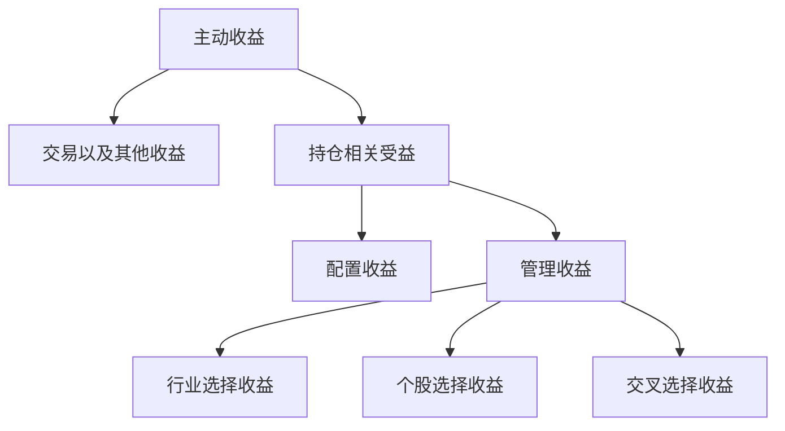

# 组合归因详解
## Brinson组合归因

Brinson 是目前最为人知的归因方案。除了需要组合持仓内容之外，还设定一个基准。最初的brinson模型是把收益拆解为行业选择收益、个股选择收益和交叉收益，我们在传统模型基础上做了进一步的扩展，拆分出配置收益和交易收益。

- 多期brinson收益分解

该策略主动收益为**105.53%**，交易及其他收益为 **-5.01%**，反映了管理人盘中买卖点选择以及其他资产带来的收益的;持仓相关收益为 **110.54%**，反映的是在股票持合中，用股票收盘价计算得到的持仓收益，配置收益为 **-14.19%**，主要是由产品的股票仓位和基准的股票仓位差异带来的，反映的是投资经理的仓位管理能力。管理收益为**12472%**，它反映的是不考虑合位的情况下，投资经理在股票内部的营理能力，其中，行业洗择收益为**78.77%**、个股选择收益为**4.94%**、交又收益为**41.01%**.

> 对于各个拆分收益的计算如下：

| 指标名称     |                                                                 指标计算                                                                 | 指标和计算解释                                                                                                       |
| ------------ | :--------------------------------------------------------------------------------------------------------------------------------------: | -------------------------------------------------------------------------------------------------------------------- |
| 主动收益     |                                        $R^p-R^b\\其中，R^p来源于净值计算，R^b来源于基准持仓计算$                                        | $R^p为组合的真实收益；R^b为基准的真实收益,\\这里我们假设基准的持仓是完全已知的，因此可以用个股的加权收益代替$        |
| 持仓收益     | $W^{p^T}*r^p-R^b\\其中，W_p同上，r^p=\begin{bmatrix}r_{1}^{p}\\...\\r_{n}^{p}\end{bmatrix},为组合持仓个股的收益。注意：权重比收益早一期$ | $表示由持仓信息计算得到的主动收益$                                                                                   |
| 交易收益     |                                                            $R^p-W^{p^T}*r^p$                                                            | $由真实收益与持仓收益相减得到，是不可观察到的$                                                                       |
| 仓位配置收益 |                                         $(w^p-w^b)R^b/w^b=(\sum w_i^p-\sum w_i^b)R^b/\sum w_i^b$                                         | $其中，wp表示组合仓位，由个股仓位加总得到；w^b表示基准仓位，由成分股仓位加总得到。\\如果基准是某一个股票指数，w^b=1$ |
| 行业选择收益 |                                           $w^p\sum(\frac{w_j^p}{w^p}-\frac{w_j^b}{w^b})r_j^b$                                           |                                                                                                                      |
| 个股选择收益 |                                                 $w^p\sum(r_j^p-r_j^b)\frac{w_j^b}{w^b}$                                                 |                                                                                                                      |
| 交叉收益     |                                       $w^p\sum(r_j^p-r_j^b)(\frac{w_j^p}{w^p}-\frac{w_j^b}{w^b})$                                       |                                                                                                                      |
| 管理收益     |                                                   $行业配置收益+个股选择收益+交叉收益$                                                   |                                                                                                                      |

上述指标的计算只针对单期的brinson拆解，为了分析策略在一个周期里的收益归类，我们使用Carino简化因子调整。

> Carino简化因子的计算方式如下：

$$
k_t=\left\{\begin{matrix}{\frac{ln(1+r_t)-ln(1+b_t)}{r_t-b_t}},&r_t-b_t
\\
\frac{1}{1+r_t},&r_t\neq b_t\end{matrix}\right.
$$

$$
k=\left\{\begin{matrix}{\frac{ln(1+r)-ln(1+b)}{r-b}},&r-b
 \\
\frac{1}{1+r},&r\neq b\end{matrix}\right.
$$

Rt，bt为t期策略和基准的收益率；r，b为区间内策略和基准收益率。

> 使用简化因子对多期收益分解进行加和：

$$
k *(r-b)=\sum_{t=1}^{m}k_t*(r_t-b_t)
$$

$$
r-b=\sum_{t}^{m}\frac{k_t}{k}*A_t+\sum_{t}^{m}\frac{k_t}{k}*S_t+\sum_{t}^{m}\frac{k_t}{k}*I_t
$$

At，St，It为t期收益的分解项。

- 行业绩效归因拆解

把收益按行业拆分，查看每个策略在每个行业是否带来了主动收益。图中主动收益展示的也是多期的收益率，通过Carino因子进行调整。主动风险计算的是多期主动风险的方差，衡量多期主动收益的稳定性。主动权重是统计整个回测区间内各行业主动权重的均值。

## 风格分析

- 基于风格因子的归因是一种更为精细的归因方式。我们使用同花顺内部准备好的一系列风格因子及因子收益率，将组合的回报和风险分别划分到这些因子上，从而得到组合的投资风格。当前包含的风格因子有：

| 风格因子代码          | 因子名称   | 含义                                   | 备注                                                                                     |
| --------------------- | ---------- | -------------------------------------- | ---------------------------------------------------------------------------------------- |
| beta                  | beta       | 上市公司与指数之间的协同性             | 个股的Beta值，指数收益使用HS300                                                          |
| bp                    | 估值       | 记账价值和市值的比值                   | 市净率=总市值/归属于母公司所有者权益合计                                                 |
| earnings\\\_yield     | 盈利       | 分析师预测与过去财年收益统计           |                                                                                          |
| growth                | 成长       | 由销售额及盈利统计。                   |                                                                                          |
| leverage              | 杠杆       | 上市公司的使用杠杆的情况。             |                                                                                          |
| liquidity             | 流动性     | 由交易量和频率不同而带来的收益         |                                                                                          |
| momentum              | 动量       | 能量性指标，表示相对强度               | 从过去某一天开始，向过去再推504天，计算其每天的超额收益对数值，再针对这504天进行加权平均 |
| non\\\_linear\\\_size | 非线性市值 | 上市公司的规模处于中等的程度           |                                                                                          |
| size                  | 市值       | 上市公司的规模，即该公司是大盘股的程度 | 对数市值                                                                                 |
| volatility            | 波动率     | 对大盘偏离的不确定性                   |                                                                                          |

- 风格归因效果图：
  
  其中主动收益是多期的收益率，通过Carino因子进行调整。主动风险计算的是多期主动风险的方差，衡量多期主动收益的稳定性。
- 策略和基准风格对比图：
  衡量回测期内策略整体风格和基准的差异，点击特定的风格因子柱状图可查看策略及基准的历史风格变化，如下图：
   组合风格稳定性：
  

> 选取策略组合在回测期间的四个界面查看其当期的主动收益、主动风险及主动暴露度。相关的计算公式如下：

| 指标名称 |                                                                                                                                                                       指标计算                                                                                                                                                                       | 指标和计算解释                                                                                                                                                                                                |
| -------- | :--------------------------------------------------------------------------------------------------------------------------------------------------------------------------------------------------------------------------------------------------------------------------------------------------------------------------------------------------: | ------------------------------------------------------------------------------------------------------------------------------------------------------------------------------------------------------------- |
| 风格权重 |                                                                         $factorweight=X*W^p，\\其中, X=\begin{bmatrix}x_{1,1} & ... & x_{n,1}\\... & ... & ... \\x_{1,10} & ... & x_{n,10} \\\end{bmatrix},W^p=\begin{bmatrix}W_1^p \\... \\W_n^p\end{bmatrix}，n为个股数量$                                                                         | $x_i,j：第i个股票在第j个风格上的暴露，j=1,2,...10; \\wi:第i个股票在组合中的权重“*”为向量乘法$                                                                                                               |
| 风格收益 |                                                                                                                         $factor \ return=factor \ weight \bullet F\\其中，F=\begin{bmatrix}f_1 \\... \\f_{10}\end{bmatrix} $                                                                                                                         | $f_j:第j个风格的收益率，j=1,2,...10, “\bullet"表示点乘$                                                                                                                                                      |
| 风格收益 |                                            $specific \ return=\begin{bmatrix}w_1^p & ... & w_n^p\\\end{bmatrix}*\begin{bmatrix}\varepsilon _1^p \\... \\\varepsilon _n^p\end{bmatrix}={w^p}^T*\varepsilon ^p\\其中，\varepsilon^p=\begin{bmatrix}\varepsilon _1^p \\... \\\varepsilon _n^p\end{bmatrix}$                                            | ${W^p}^T为W^P的转置向量；\varepsilon_i^p为组合第i个股票的特质收益率$                                                                                                                                          |
| 风格风险 |                                                                           $factor \ risk=\frac{factor \  weight \bullet (\Lambda_f*factor \ weight)}{\sqrt{{W^p}^T*\Lambda_s*W^p}}\\specific \ risk=\frac{{W^p}^T*\Lambda_\varepsilon*W^p}{\sqrt{{W^p}^T*\Lambda_s*W^p}}$                                                                           | $\Lambda_f:因子收益率的协方差矩阵，取过去120个交易日计算；\\\Lambda_\varepsilon:组合持仓个股特质收益率的协方差矩阵，取过去120个交易日计算；\\\Lambda_s:组合持仓个股收益率的协方差矩阵，取过去120个交易日计算$ |
| 主动权重 |                                                                                                                        $active \ weight=X*(W^p-W^b),\\其中，W^b=\begin{bmatrix}W_1^b \\... \\W_n^b\end{bmatrix}，n为个股数量$                                                                                                                        | $仅计算风格因子$                                                                                                                                                                                              |
| 主动收益 |                                                                                                                                                 $active \ factor \ return=active \ weight \bullet F$                                                                                                                                                 | $风格因子的主动权重*风格因子收益率$                                                                                                                                                                           |
| 主动收益 |                $active \ specific\ return= \begin{bmatrix}W_1^p & ... & W_n^p\\\end{bmatrix}*\begin{bmatrix}\varepsilon _1^p\\...\\\varepsilon _n^p\end{bmatrix}-\begin{bmatrix}W_1^b & ... & W_n^b\\\end{bmatrix}*\begin{bmatrix}\varepsilon _1^b\\...\\\varepsilon _n^b\end{bmatrix}={w^p}^T*\varepsilon ^p-{w^b}^T*\varepsilon ^b$                | $组合的特质收益-基准的特质收益$                                                                                                                                                                               |
| 主动风险 | $active factor risk =\frac{\text { active weight } \cdot\left(\Lambda_f * \text { active weight }\right)}{\sqrt{\left(W^p-W^b\right)^T * \Lambda_{a s} *\left(W^p-W^b\right)}}\\active specificrisk=\frac{\left(W^p-W^b\right)^T * \Lambda_{a \epsilon} *\left(W^p-W^b\right)}{\sqrt{\left(W^p-W^b\right)^T * \Lambda_{a s} *\left(W^p-W^b\right)}}$ | $\Lambda_{a s}:组合持仓个股与基准持仓个股取并集后的协方差矩阵，取过去120个交易日计算\\\Lambda_{a \epsilon}:组合持仓个股与基准持仓个股取并集后的特质收益率协方差矩阵，取过去120个交易日计算$                   |
